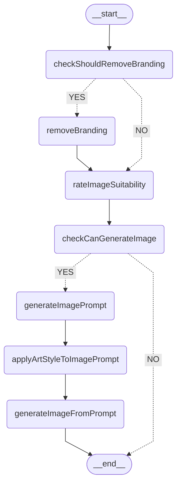

# Workshop: Using LangGraphJS for Tweet-to-Image Generation

## Use Case

This code demonstrates a **Tweet-to-Image Generation Workflow** using LangGraphJS. The workflow takes a tweet as input and processes it through several stages to produce an image that visually represents the tweet's content. The key steps include:

1. **Removing Branding**: Rewriting tweets to remove specific entities like brands or logos.
2. **Generating an Image Prompt**: Creating a concise prompt for image generation based on the tweet's content.
3. **Applying Art Styles**: Enhancing the image prompt with a specific artistic style.
4. **Generating the Image**: Producing the final image using an AI-based image generation model.

---

## Thought Process

1. **Define the Workflow**:

   - Break down the problem into discrete tasks (e.g., removing branding, generating prompts, applying styles).
   - Use LangGraphJS to model these tasks as nodes in a state graph.

2. **Leverage AI Models**:

   - Use OpenAI GPT for text-based tasks like rewriting tweets and rating suitability.
   - Use Google Generative AI for generating image prompts and applying artistic styles.

3. **State Management**:

   - Use `Annotation` to manage state variables like the tweet content, art style, and generated images.

4. **Iterative Refinement**:
   - Start with a basic image prompt and iteratively enhance it by applying artistic styles.

---

## Workflow Diagram

Below is the visual representation of the workflow:



---

## Introduction to LangGraphJS and Tools

### What is LangGraphJS?

LangGraphJS is a library for building **stateful workflows** using a graph-based approach. It allows you to define nodes (representing tasks) and edges (representing transitions) to create a structured flow of operations.

### Tools Used in This Code

1. **LangGraphJS**:
   - `StateGraph`: Defines the workflow as a graph.
   - `Annotation`: A declarative way to define and manage state variables in LangGraphJS. Each annotation represents a specific variable in the workflow and provides features like default values and reducers.
2. **LangChain Core**:
   - `PromptTemplate`: Used to define reusable templates for generating prompts.
3. **Google Generative AI**:
   - `ChatGoogleGenerativeAI`: Generates image prompts using Google's Gemini model.
4. **OpenAI GPT**:
   - `ChatOpenAI`: Handles tasks like rewriting tweets and rating image suitability.
5. **Zod**:
   - Used for schema validation of structured outputs, ensuring AI-generated data conforms to expected formats.
6. **Dedent**:
   - Simplifies multi-line string formatting for prompts.

---

## Detailed Concepts

### **Annotations in LangGraphJS**

Annotations are a declarative way to define and manage state variables in LangGraphJS. They allow you to:

- Define the structure of the state.
- Set default values for variables.
- Use reducers to control how state updates are handled.

#### Example:

```typescript
const StateAnnotation = Annotation.Root({
  tweet: Annotation<string>,
  artStyle: Annotation<string>({
    default: () => "NONE",
    reducer: (a, b) => b,
  }),
  shouldRemoveBranding: Annotation<boolean>({
    default: () => true,
    reducer: (a, b) => b,
  }),
});
```

- **Default Values**: Ensure variables have sensible initial values. For example, `artStyle` defaults to `"NONE"`, and `shouldRemoveBranding` defaults to `true`.
- **Reducers**: Define how new values replace or modify existing ones. For example, `(a, b) => b` replaces the old value with the new one.

#### Why Use Annotations?

- **Consistency**: Ensures all nodes in the workflow operate on a consistent state structure.
- **Flexibility**: Allows dynamic updates to state variables.
- **Debugging**: Provides a clear and declarative view of state variables and their behavior.

---

### **Using Zod for Structured Output Validation**

`Zod` is used to validate the outputs of AI models to ensure they conform to a predefined structure. This prevents errors and ensures reliability.

#### Example:

```typescript
const rateImageSuitabilitySchema = z.object({
  rating: z.number().describe("A number between 1 and 10"),
  ratingExplanation: z.string().describe("A string explaining the rating"),
});

const rateImageLlm = openaiLLM.withStructuredOutput(
  rateImageSuitabilitySchema,
  { name: "rateImageSuitability" }
);
```

- **Schema Definition**: Defines the expected structure of the output (e.g., `rating` as a number and `ratingExplanation` as a string).
- **Validation**: Ensures the AI model's output matches the schema before it is used in the workflow.

#### Why Use Zod?

- **Error Prevention**: Ensures AI outputs adhere to the expected format, reducing runtime errors.
- **Type Safety**: Provides strong typing for downstream code.
- **Reliability**: Guarantees the workflow operates on well-structured data.

---

### **LangGraphJS Workflow**

LangGraphJS uses a graph-based approach to model workflows. Each task is represented as a node, and transitions between tasks are represented as edges.

#### Example:

```typescript
const graph = new StateGraph(StateAnnotation)
  .addNode("removeBranding", removeBranding)
  .addNode("rateImageSuitability", rateImageSuitability)
  .addEdge("removeBranding", "rateImageSuitability")
  .compile();
```

- **Nodes**: Represent individual tasks (e.g., `removeBranding`).
- **Edges**: Define the flow between tasks.
- **Conditional Edges**: Allow branching logic based on state.

---

## Pros of This Approach

1. **Modularity**:

   - Each task is encapsulated in a node, making the workflow easy to extend or modify.

2. **Reusability**:

   - The state graph can be reused for similar workflows with minimal changes.

3. **Scalability**:

   - The graph-based approach allows for adding new nodes and edges without disrupting the existing workflow.

4. **Reliability**:
   - Validates AI outputs using Zod, ensuring structured and predictable data.

---

## How to Run the Code

1. Install dependencies:

   ```bash
   pnpm install
   ```

2. Set up environment variables in `.env`:

   ```env
   OPENAI_API_KEY=<your_openai_api_key>
   GOOGLE_GENERATIVE_AI_API_KEY=<your_google_api_key>
   ```

3. Run the example script:
   ```bash
   pnpm start:example
   ```
